# 02 — Especificação Técnica: Sistema de Planejamento Orçamentário ATEM

Base: análise em [`01-analise-templates.md`](01-analise-templates.md).

## 1. Princípios de projeto

1. **Excel é fonte, não modelo.** Cada aba vira (a) dado mestre, (b) fato, (c) parâmetro ou (d) regra de cálculo no backend.
2. **Granularidade única:** `empresa × filial × centro de custo × conta × competência (mês)`. A "chave orçamentária" do Excel (`1001-FILIAL-CC-CONTA`) é uma visão derivada, não um campo digitado.
3. **Nada que muda por ciclo fica no código:** ano fiscal, prazos, multiplicadores, limites de alerta, tipos de contrato/projeto, listas de domínio, gestores e tipo de pacote, tarifas de viagem → tabelas parametrizadas por ciclo.
4. **Imutabilidade de histórico:** toda carga gera uma `dataset_version`; versões antigas permanecem consultáveis; fatos referenciam a versão.
5. **Workflow e auditoria nativos:** toda transição de status e toda alteração relevante gera registro.
6. **Pronto para SAP:** o realizado é modelado no grão de documento (estrutura KSB1) com campo `source`; a importação Excel é apenas um *adapter*.

## 2. Arquitetura

```
┌──────────────────────── Railway ─────────────────────────┐
│  Serviço "web" (1 container Docker)                      │
│  ┌──────────────┐   ┌─────────────────────────────────┐  │
│  │ Frontend SPA │──▶│ FastAPI (REST /api/v1)          │  │
│  │ React + Vite │   │  ├─ auth (JWT) + RBAC + escopo   │  │
│  │ (estático)   │   │  ├─ módulos: cadastros, imports, │  │
│  └──────────────┘   │  │  opex, capex, pessoal,        │  │
│                     │  │  workflow, dashboard, export  │  │
│                     │  ├─ domain/rules (cálculo puro)  │  │
│                     │  └─ worker de importação (fila   │  │
│                     │     em tabela, SKIP LOCKED)      │  │
│                     └───────────┬─────────────────────┘  │
│  Volume /data (arquivos)        │                        │
│                      ┌──────────▼──────────┐             │
│                      │ PostgreSQL 16       │             │
│                      └─────────────────────┘             │
└──────────────────────────────────────────────────────────┘
```

| Camada | Escolha | Motivo |
|---|---|---|
| Backend | Python 3.11, FastAPI, SQLAlchemy 2, Alembic, Pydantic 2 | Ecossistema de dados/Excel (openpyxl), tipagem, OpenAPI automático |
| Banco | PostgreSQL 16 (plugin Railway) | `NUMERIC(18,2)`, JSONB, `SKIP LOCKED`, views |
| Fila | Tabela `import_batches` + worker em thread (mesmo container); separável em serviço `worker` com a mesma imagem (`python -m app.worker`) | Zero infraestrutura extra no MVP |
| Arquivos | Volume Railway em `/data/uploads` via interface `Storage` (troca por S3 sem mudar regra) | Simples e substituível |
| Frontend | React + Vite + TypeScript, AG Grid Community (tabelas editáveis), Recharts | Grade editável estilo planilha |
| Auth | JWT (access) + bcrypt; perfis e escopo por CC | Sem dependência externa; SSO (Azure AD) plugável depois |
| Excel | openpyxl (leitura/exportação) | Lê templates com fórmulas e tabelas |

Deploy: `Dockerfile` multi-stage (build do front → imagem Python), `alembic upgrade head` no start, healthcheck `/api/health`.

## 3. Perfis e permissões

| Perfil (`roles.code`) | Escopo | Permissões principais |
|---|---|---|
| `ADMIN` | global | cadastros, usuários, ciclos, parâmetros, importações, auditoria, tudo de CONTROLLER |
| `CONTROLLER` (Validador/Controladoria) | global | analisar, solicitar ajuste, aprovar/reprovar, consolidar, importar, exportar |
| `MANAGER` (Gestor de CC) | CCs onde é gestor + `user_scopes` | ver histórico, preencher, justificar, enviar |
| `PACKAGE_MANAGER` (Gestor de pacote GMD) | pacotes atribuídos no ciclo (por empresa) | ver linhas do pacote em todos os CCs; **validar (Tipo 1)** ou comentar (Tipo 2) |
| `HR` | módulo pessoal | quadro, movimentações, cenários |
| `VIEWER` | escopo atribuído | leitura |

Um usuário pode ter vários perfis. A autorização é sempre **perfil + escopo** (CC/empresa/pacote).

## 4. Modelo de dados

### 4.1 Diagrama (núcleo)

```mermaid
erDiagram
  companies ||--o{ branches : tem
  companies ||--o{ cost_centers : tem
  users ||--o{ cost_centers : "gestor de"
  budget_packages ||--o{ accounts : agrupa
  accounts ||--o{ account_details : detalha
  budget_packages ||--o{ package_managers : "gestor por ciclo/empresa"
  budget_cycles ||--o{ budget_versions : versiona
  budget_versions ||--o{ budget_submissions : "CC x módulo"
  budget_submissions ||--o{ budget_lines : contem
  budget_lines ||--o{ budget_line_values : "12 meses"
  budget_submissions ||--o{ workflow_events : historico
  budget_submissions ||--o{ package_reviews : "validação GMD"
  budget_submissions ||--o{ capex_projects : contem
  capex_projects ||--o{ capex_items : itens
  capex_items ||--o{ capex_item_values : cronograma
  budget_submissions ||--o{ personnel_movements : contem
  employees ||--o{ personnel_movements : sofre
  contract_types ||--o{ employees : regime
  import_batches ||--o{ import_errors : gera
  import_batches ||--o| dataset_versions : publica
  dataset_versions ||--o{ actual_entries : contem
  dataset_versions ||--o{ reference_budget_entries : contem
```



### 4.2 Tabelas

**Segurança**
- `users(id, email UNIQUE, name, password_hash, is_active, last_login_at, created_at)`
- `roles(code PK, name)`, `user_roles(user_id, role_code)`
- `user_scopes(id, user_id, company_id?, cost_center_id?)` — escopo adicional além de `cost_centers.manager_user_id`

**Organização e plano de contas**
- `companies(id, code UNIQUE ['1001'], name, short_name, is_active)`
- `branches(id, company_id, code ['0001'], name, uf, is_active)` — UNIQUE(company_id, code)
- `departments(id, name UNIQUE)`, `areas(id, name, department_id?)`
- `cost_centers(id, company_id, code, name, manager_user_id?, manager_name, department_id?, area_id?, is_csc, is_backoffice, is_active)` — UNIQUE(company_id, code)
- `budget_packages(id, code UNIQUE, name, roman, package_type [1|2], nature, form_type, is_active)` — `form_type` define o formulário/calculadora (`GENERIC`, `TRAVEL`, `EVENT`, `CAPEX`, `PERSONNEL`)
- `accounts(id, code UNIQUE, name, dre_group, nature [OPEX|CAPEX|PESSOAL|FINANCEIRO|CUSTO], package_id?, is_active)` — conta pode aparecer em **qualquer** CC (sem amarração 1:1)
- `account_details(id, account_id, name)` — "Detalhamento" (DTI)
- `package_managers(id, cycle_id, package_id, company_id?, user_id?, manager_name, scope_label)` — permite "Infraestrutura ATEM/REAM/NAVE"

**Ciclo, parâmetros e domínios**
- `budget_cycles(id, fiscal_year UNIQUE, name, status [DRAFT|OPEN|CLOSED], actual_reference_year, opex_deadline, capex_deadline, personnel_deadline)`
- `cycle_parameters(cycle_id, key, value JSONB, description)` — ex.: `alert.growth_pct=0.20`, `alert.reduction_pct=0.30`, `travel.one_way_factor=0.5`, `capex.min_unit_value=1200`, `personnel.salary_adjustment_pct=0.05`
- `lookup_values(id, domain, code, label, sort_order, extra JSONB, is_active)` — listas: `TRIP_TYPE`, `JOB_LEVEL`, `MONTH`, `EVENT_TYPE{meal_per_person}`, `WORK_TYPE`, `PRIORITY`, `YES_NO`, `LAWSUIT_PROBABILITY`, `DTI_CONTRACT_TYPE`, `CAPEX_PROJECT_TYPE`, `PERSONNEL_ACTION`
- `travel_fares(cycle_id, origin, destination, trip_type, round_trip_amount)` — matriz de passagens
- `travel_rates(cycle_id, rate_type [LODGING|PER_DIEM|CAR_RENTAL], trip_type, job_level, daily_amount)`
- `macro_assumptions(id, dataset_version_id, indicator, segment?, source, year, value, unit, reference_date, is_official)`

**Fatos de referência (histórico)**
- `actual_entries(id, dataset_version_id, company_id, branch_id?, cost_center_id, account_id, fiscal_year, period, posting_date?, document_number?, document_type?, vendor_code?, vendor_name?, text?, currency, amount NUMERIC(18,2), source [EXCEL|SAP_KSB1|SAP_API])` — grão de documento quando houver (KSB1), ou mensal agregado (planilha).
- `reference_budget_entries(id, dataset_version_id, scenario ['ORC'], fiscal_year, company_id, branch_id?, cost_center_id, account_id, period, amount)` — Orçamento 2026 e anteriores.
- `dataset_versions(id, dataset_type, scope_key ['ACTUAL:2026'], version_number, import_batch_id, is_current, created_by, created_at, superseded_at)` — **Importação → Versão → Data → Usuário → Fonte**.

**Orçamento em elaboração**
- `budget_versions(id, cycle_id, label ['1.0','1.1','2.0'], major, minor, status [WORKING|FROZEN], parent_version_id?, reason, created_by, created_at, frozen_at)`
- `budget_submissions(id, version_id, cost_center_id, module [OPEX|CAPEX|PERSONNEL], status, submitted_at, approved_at, consolidated_at, updated_at)` — UNIQUE(version, cc, module); unidade do workflow
- `budget_lines(id, submission_id, company_id, branch_id?, cost_center_id, account_id, package_id, account_detail_id?, line_type, description, justification, assumption, supplier, contract_manager, attributes JSONB, total_amount, created_by, updated_by, created_at, updated_at)` — `attributes` guarda os campos específicos do pacote (origem/destino, nº pessoas, tipo de obra…)
- `budget_line_values(line_id, month 1..12, amount)` — PK(line_id, month)
- `account_justifications(submission_id, account_id, text, updated_by, updated_at)` — justificativa de variação no nível da conta
- `package_reviews(id, submission_id, package_id, reviewer_id, status [PENDING|APPROVED|ADJUST_REQUESTED|COMMENTED], comment, updated_at)` — GMD
- `workflow_events(id, submission_id, from_status, to_status, action, comment, version_label, user_id, created_at)`

**CAPEX**
- `asset_classes(id, name, account_id)`, `asset_items(id, name, asset_class_id)` — catálogo "LISTA ATIVOS"
- `capex_projects(id, submission_id, code, company_id, branch_id?, cost_center_id, is_project, project_type_code?, title, description, justification, expected_cost_reduction, expected_revenue, priority, budget_prev_year, observations)`
- `capex_items(id, project_id, account_id, asset_item_id?, item_name, description, unit_value, quantity, total_value, useful_life_months?)`
- `capex_item_values(item_id, month, amount)`

**Pessoal**
- `contract_types(code PK ['CLT','PJ','ESTAGIO','APRENDIZ','TEMPORARIO'], name, apply_multiplier, default_multiplier)`
- `job_positions(id, name UNIQUE, level?)`
- `employees(id, registration, name, company_id, branch_id?, cost_center_id, department_id?, area_id?, position_id?, contract_type_code, base_salary, admission_date?, termination_date?, is_csc, is_active, dataset_version_id?)` — UNIQUE(company_id, registration)
- `benefit_types(code PK, name, account_id?, calc_mode [FLAG|PER_DEPENDENT|AMOUNT], default_amount)`, `employee_benefits(employee_id, benefit_code, quantity, amount)`
- `personnel_movements(id, submission_id, employee_id?, movement_type [KEEP|PROMOTION|SALARY_ADJUSTMENT|HIRE|TERMINATION|TRANSFER], effective_month, quantity, position_id?, new_salary?, contract_type_code?, cost_center_id, department_id?, area_id?, multiplier_override?, severance_cost?, reason)` — admissões e desligamentos são movimentos (views `v_hires`, `v_terminations`), evitando 3 tabelas com o mesmo grão
- `personnel_scenarios(id, cycle_id, name, is_baseline, salary_adjustment_pct, created_by)`, `scenario_multipliers(scenario_id, contract_type_code, multiplier)`

**Importação e auditoria**
- `import_batches(id, dataset_type, layout, file_name, file_sha256, storage_path, file_size, status, cycle_id?, reference_year?, total_rows, valid_rows, error_rows, duplicate_rows, warning_rows, summary JSONB, uploaded_by, confirmed_by, created_at, validated_at, confirmed_at, completed_at, error_message)`
- `import_rows(id, batch_id, sheet, row_number, natural_key, status [VALID|WARNING|ERROR|DUPLICATE], data JSONB)` — staging (prévia)
- `import_errors(id, batch_id, sheet, row_number, column, code, severity, message, value)`
- `audit_logs(id, occurred_at, user_id?, action, entity_type, entity_id, before JSONB, after JSONB, reason, request_id, ip)`

## 5. Regras de negócio (fórmula Excel → backend)

| Origem | Fórmula Excel | Regra no sistema (`app/domain/rules`) |
|---|---|---|
| Todas abas | `XLOOKUP` filial/CC/conta → código | FK; seleção por autocomplete; conta restrita ao pacote |
| Todas abas | `CHAVE = 1001-filial-cc-conta` | `budget_key(company, branch, cc, account)` derivado |
| Todas abas | `2027 = SUM(JAN:DEZ)` | `total_amount` recalculado no save |
| Viagens | `OFFSET` matriz; `/2` se sem volta | `travel.ticket = fare(dest, origin) × (1 se volta senão one_way_factor)` |
| Viagens | `SUMIFS(tarifas)*dias` | `per_diem = rate(PER_DIEM, tipo, cargo) × dias`; `lodging = rate(LODGING, tipo, cargo) × dias` |
| Viagens | Consolidador por mês de ida | 1 viagem → 3 `budget_lines` (contas 6010301011/036/001) no mês de ida |
| Eventos | `VLOOKUP(Interno/Externo)*pessoas` + soma | `event.total = meal(tipo) × pessoas + gráfico + estrutura + brindes + deslocamento`, no mês do evento |
| DTI | `XLOOKUP(FILTER(Detalhamento))` | `account_details` → conta |
| Resumo | `SUMIFS` por pacote | view agregada `pacote × mês` |
| CAPEX | `N = L × M` | `total_value = unit_value × quantity` |
| CAPEX | `IF(soma−total=0,"ok",…)` | **inconsistência crítica** se `|Σ meses − total| > 0,01` → bloqueia envio/aprovação |
| CAPEX | requisitos (instrução) | alerta se `unit_value < capex.min_unit_value` (possível OPEX) |
| CAPEX | Projeto?=Sim | exige `project_type_code` e `justification` |
| Pessoal | `IF(MANTER/PROMOVER/REMOVER/INCLUIR, mês≥J)` | `monthly_salary(m)` por movimento (ver 5.1) |
| Pessoal | `F9 = F8 × (1+5%)` | `salary_adjustment_pct` do cenário |
| Pessoal | (novo) | `custo = salário × multiplicador(contrato)`; PJ sem multiplicador |

### 5.1 Projeção de pessoal

```
salário_mês(m):
  KEEP / sem movimento     → base
  PROMOTION | ADJUSTMENT   → m ≥ mês_efetivo ? novo_salário : base
  TERMINATION              → m ≥ mês_efetivo ? 0 : base
  HIRE                     → m ≥ mês_efetivo ? novo_salário × quantidade : 0
salário_mês ← salário_mês × (1 + reajuste_cenário)   (se aplicável a partir do mês de data-base)
custo_mês = salário_mês × multiplicador(contrato)      se contract.apply_multiplier
          = salário_mês                                senão (PJ = valor do contrato)
```

What-if: o cenário sobrescreve multiplicadores por tipo de contrato (1,8 / 1,9 / 2,0 / 2,1…) e o % de reajuste; o endpoint devolve **custo atual, projetado, diferença, %, impacto mensal e anual** sem gravar (simulação) e permite salvar o cenário.

Headcount: `HC_atual (ativos em dez/ano-1) + Σ admissões − Σ desligamentos = HC_projetado`, por mês, área e departamento.

### 5.2 Pontos de atenção (parametrizados em `cycle_parameters`)

| Código | Condição |
|---|---|
| `GROWTH_ABOVE` | Orç. 2027 > Realizado 2026 anualizado × (1 + `alert.growth_pct`) |
| `REDUCTION_ABOVE` | Orç. 2027 < Realizado 2026 anualizado × (1 − `alert.reduction_pct`) |
| `ABOVE_HISTORY` / `BELOW_HISTORY` | Orç. 2027 vs média (2025, 2026 anualizado) fora da banda `alert.history_band_pct` |
| `NEW_ACCOUNT` | Conta orçada sem realizado em 2025/2026 |
| `NO_BUDGET` | Conta com realizado 2026 > `alert.min_relevant_amount` e sem orçamento 2027 |
| `CC_NOT_FILLED` | Submissão em `DRAFT`/`IN_PROGRESS` sem linhas após prazo |
| `CAPEX_NO_JUSTIFICATION` | Projeto sem justificativa |
| `CAPEX_SCHEDULE_MISMATCH` | Σ cronograma ≠ total (**crítico**) |
| `MISSING_JUSTIFICATION` | Variação acima do limite sem `account_justifications` |

Realizado 2026 anualizado = `Σ jan..mês_fechado × 12 / mês_fechado` (o último mês fechado vem da versão importada).

## 6. Workflow

```
DRAFT ─▶ IN_PROGRESS ─▶ SUBMITTED ─▶ UNDER_REVIEW ─▶ APPROVED ─▶ CONSOLIDATED
                ▲                         │
                └──── ADJUSTMENT_REQUESTED ◀┘   (também a partir de SUBMITTED)
```

| Ação | De → Para | Quem | Pré-condições |
|---|---|---|---|
| editar | DRAFT→IN_PROGRESS (automático na 1ª edição) | MANAGER | ciclo OPEN, versão WORKING |
| submit | IN_PROGRESS/ADJUSTMENT_REQUESTED → SUBMITTED | MANAGER | sem inconsistência crítica; justificativas obrigatórias preenchidas |
| start_review | SUBMITTED → UNDER_REVIEW | CONTROLLER | — |
| request_adjustment | SUBMITTED/UNDER_REVIEW → ADJUSTMENT_REQUESTED | CONTROLLER / PACKAGE_MANAGER (Tipo 1) | comentário obrigatório |
| approve | UNDER_REVIEW → APPROVED | CONTROLLER | todos os pacotes **Tipo 1** com `package_reviews=APPROVED`; zero críticos |
| reject | UNDER_REVIEW → ADJUSTMENT_REQUESTED | CONTROLLER | comentário |
| consolidate | APPROVED → CONSOLIDATED | CONTROLLER/ADMIN | — |

Edição só em DRAFT/IN_PROGRESS/ADJUSTMENT_REQUESTED. **Congelamento:** ao consolidar, a versão fica `FROZEN`; alteração posterior exige `POST /versions/{id}/revise` (motivo obrigatório) → nova versão `1.1` (minor) ou `2.0` (major, ex.: revisão geral), copiando linhas; a anterior permanece imutável.

## 7. Módulos e endpoints (REST `/api/v1`)

| Módulo | Endpoints principais | Fase |
|---|---|---|
| Auth | `POST /auth/login`, `GET /auth/me` | 1 |
| Usuários | `GET/POST/PATCH /users`, `PUT /users/{id}/roles`, `PUT /users/{id}/scopes` | 1 |
| Cadastros | `/companies`, `/branches`, `/cost-centers`, `/accounts`, `/packages`, `/package-managers`, `/lookups/{domain}`, `/contract-types` | 1 |
| Ciclos | `/cycles`, `/cycles/{id}/parameters`, `/cycles/{id}/open|close`, `/versions` | 1 |
| Importação | `POST /imports` (upload), `GET /imports/{id}` (status + resumo), `GET /imports/{id}/preview`, `GET /imports/{id}/errors.xlsx`, `POST /imports/{id}/confirm`, `POST /imports/{id}/reject`, `GET /dataset-versions` | 1 |
| Auditoria | `GET /audit-logs` (filtros entidade/usuário/período) | 1 |
| Regras (simulação) | `POST /rules/travel`, `/rules/event`, `/rules/capex-item`, `/rules/personnel-projection` | 1 |
| OPEX | `/opex/summary`, `/opex/cost-centers/{cc}` (abre/cria), `/opex/submissions/{id}/accounts` (2025R → 2026R/anualizado → 2026O → 2027P com alertas), `.../lines` (GENERIC/TRAVEL/EVENT), `/opex/lines/{id}`, `.../justifications/{conta}`, `/opex/options` | 2 ✅ |
| Workflow | `POST /opex/submissions/{id}/actions/{submit\|recall\|start_review\|request_adjustment\|approve\|reopen\|consolidate}`, `.../events`, `.../package-reviews/{pacote}`, `/opex/review-queue` | 2 ✅ |
| CAPEX | `/submissions/{id}/capex-projects`, itens, cronograma | 3 |
| Pessoal | `/employees`, `/submissions/{id}/movements`, `/personnel/scenarios`, `/personnel/what-if`, `/personnel/headcount`, `/personnel/terminations` | 4 |
| Painel | `/dashboard/overview` (KPIs, mensal, pacotes, rankings, com filtros e escopo do usuário), `/dashboard/data-quality` | 1 ✅ |
| Alertas/Export | `/attention-points`, `/exports/{tipo}.xlsx` | 5 |

## 8. Importação de dados

Pipeline (estado em `import_batches.status`):

```
UPLOADED → VALIDATING → VALIDATED ──confirm──▶ PROCESSING → COMPLETED
               │             └──reject──▶ REJECTED
               └──▶ FAILED (estrutura inválida)
```

1. **Upload** → grava arquivo (`/data/uploads/{sha256}`), calcula hash (alerta se o mesmo arquivo já foi importado).
2. **Detecção de layout** por assinatura de abas/cabeçalhos:

| `dataset_type` | Layout detectado | Assinatura |
|---|---|---|
| `MASTER_DATA` | `TEMPLATE_BD` | aba `BD-Novo` com tabelas Filiais/Centro_de_Custos/Pacotes |
| `COST_CENTERS` / `ACCOUNTS` | `FLAT` | colunas `Centro de Custo`/`Conta do Razão` |
| `ACTUAL` | `TEMPLATE_REALIZADO` | aba `Realizado AAAA` (formato largo mês a mês) |
| `ACTUAL` | `SAP_KSB1` | colunas `Centro de custo`, `Classe de custo`, `Período`, `Exercício`, `Valor/moeda ACC` (aliases) |
| `REFERENCE_BUDGET` | `TEMPLATE_REALIZADO`/`FLAT` | mesmo layout largo com cenário informado |
| `EMPLOYEES` | `TEMPLATE_QUADRO` | aba `QUADRO FUNCIONARIOS` |
| `MACRO_ASSUMPTIONS` | `TEMPLATE_PREMISSAS` | aba `PREMISSAS MACROECONOMICAS` |

3. **Validação** por linha: obrigatórios, tipos (número/data/mês), domínio (empresa/CC/conta/filial existentes — CC/conta inexistentes podem ser **auto-criados** se o usuário marcar a opção, para cargas mestres), duplicidade pela chave natural, colunas desconhecidas (warning).
4. **Prévia**: contagens (`4.392 encontrados / 4.350 válidos / 32 inconsistentes / 10 duplicados`), 100 primeiras linhas, erros agrupados por código; relatório `.xlsx` de erros.
5. **Comparação com a base vigente** (antes de confirmar): novos, alterados, idênticos e combinações ausentes do arquivo, com total vigente × total após a carga.
6. **Proteção contra carga repetida:** se o arquivo é idêntico (mesmo SHA-256) a um já carregado, ou não traz nenhuma alteração, a confirmação é bloqueada e só prossegue com `force=true` (registrado na auditoria).
7. **Modo de carga** (realizado e orçamento de referência):
   - `MERGE` (padrão) — grava as combinações filial × CC × conta do arquivo e **mantém** as demais da versão vigente (cargas parciais não apagam dados);
   - `REPLACE` — a base da empresa no ano passa a ser exatamente o arquivo; a prévia lista o que deixará de valer.
8. **Confirmação** → transação única: cria `dataset_version` (n+1) por empresa × ano, marca a anterior `is_current=false` (não apaga), insere fatos, registra `audit_logs`. **Toda consulta soma apenas versões vigentes** — versões anteriores existem só para histórico.

Checagens pós-carga (`GET /dashboard/data-quality`): realizado dos dois anos carregado, escopos com mais de uma versão vigente, CCs sem usuário gestor, contas sem pacote, realizado em contas sem pacote, importações pendentes, arquivos repetidos, colaboradores sem CC.

## 9. Fluxo do gestor (UX)

1. Login → **Meus centros de custo** (cards com status e % preenchido por módulo).
2. CC → aba **Histórico**: tabela por conta com `2025 R | 2026 R (até mês X) | 2026 R anualizado | 2026 O | 2027 P | Δ% ` + mini-gráfico mensal.
3. **Preencher 2027** por pacote (abas I–XII): grade editável; filial/conta por autocomplete; calculadoras (viagem/evento) preenchem meses automaticamente; validação em tempo real.
4. **Justificativas**: contas com variação acima do limite aparecem destacadas e exigem texto.
5. **Enviar para validação** (checklist de pendências antes de habilitar o botão).
6. Acompanhar status e comentários (timeline do workflow).

Controladoria: painel de acompanhamento (CC × status × prazo), pontos de atenção, revisão com comparação, ações de workflow, consolidação e exportação.

## 10. Roadmap

| Fase | Entregas | Status |
|---|---|---|
| 1 — Fundação | Arquitetura, banco completo (todas as entidades), auth/RBAC, cadastros, ciclos/parâmetros, importação (mestres, realizado template/KSB1, orçamento de referência, colaboradores, premissas) com validação/prévia/versão, auditoria, regras de cálculo puras + testes, deploy Railway | **entregue** |
| 2 — OPEX | Histórico comparativo por conta; grade de preenchimento por pacote (colar do Excel, ÷12, média 2026); calculadoras de viagem e evento; justificativas obrigatórias; workflow + validação GMD Tipo 1; fila do gestor de pacote | **entregue** |
| 3 — CAPEX | Projetos/itens/cronograma, catálogo de ativos, bloqueio por inconsistência | próxima |
| 4 — Pessoal | Quadro, movimentos, what-if, admissões/desligamentos, headcount | |
| 5 — Consolidação | Dashboard executivo, variações, exportações xlsx, consolidação final e versões | |

## 11. Decisões e pontos em aberto

| # | Decisão tomada | A confirmar com a Controladoria |
|---|---|---|
| 1 | Multiplicador de pessoal (1,8 CLT) aplicado sobre salário como proxy de encargos+benefícios; benefícios detalhados ficam como informação (não somados) para evitar dupla contagem | Manter proxy ou detalhar encargos por rubrica? |
| 2 | Realizado 2026 anualizado linearmente para comparação | Usar sazonalidade de 2025? |
| 3 | Códigos de empresa além de 1001/2001 cadastráveis | Lista oficial de códigos SAP das demais empresas |
| 4 | Filial vinculada à empresa (local de negócios SAP) | Confirmar se os códigos de filial se repetem entre empresas |
| 5 | Pacote "Pessoas" (Tipo 1, gestora Claudia Chunia) valida o módulo Pessoal | Confirmar fluxo RH × gestor de CC |
| 6 | CSC: orçado na ATEM no CC da área; rateio fica fora do MVP (tabela de rateio na Fase 5) | Matriz de rateio será fornecida pela contabilidade? |

## 12. Regras implementadas na Fase 2 (OPEX)

- **Unidade de trabalho:** versão vigente × centro de custo × módulo OPEX (`budget_submissions`), criada ao abrir o CC.
- **Quem edita:** gestor vinculado ao CC (ou escopo) e Controladoria, com status Rascunho, Em preenchimento ou Ajuste solicitado. Gestor só edita com ciclo **Aberto**; Controladoria pode preparar com o ciclo em preparação.
- **Referência da variação:** 2026 anualizado (realizado até o último mês × 12 / meses); na falta, orçado 2026; na falta, realizado 2025.
- **Alertas por conta** (limites em Parâmetros): `GROWTH_ABOVE`, `REDUCTION_ABOVE`, `NEW_ACCOUNT`, `NO_BUDGET`; ignorados quando referência e proposta ficam abaixo de `alert.min_relevant_amount`. Conta com alerta exige justificativa para enviar.
- **Viagem:** gera passagem/diária/hospedagem no mês de ida (mesmo `group_ref`); passagem pela matriz do ciclo ou informada pelo gestor; só ida = fator do ciclo.
- **Evento:** alimentação por pessoa (Interno/Externo, lista parametrizável) + materiais, no mês do evento.
- **GMD:** ao enviar, cada pacote **Tipo 1** presente recebe validação pendente; gestor do pacote valida ou pede ajuste (volta para o gestor); a aprovação exige todos os Tipo 1 validados. Tipo 2 é consultivo.
- **Auditoria:** cada linha criada/alterada/excluída, justificativa e transição de workflow.
