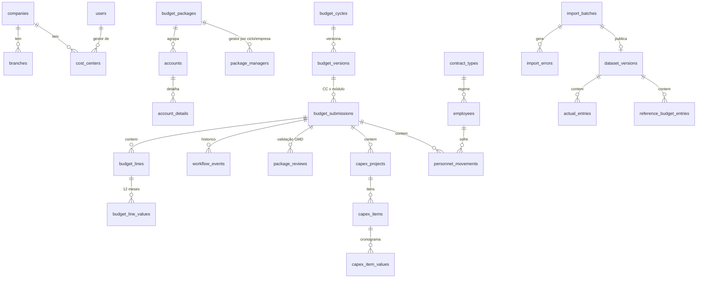

# 02 — Especificação Técnica: Sistema de Planejamento Orçamentário ATEM

Base: análise em [`01-analise-templates.md`](01-analise-templates.md).

## 1. Princípios de projeto

1. **Excel é fonte, não modelo.** Cada aba vira (a) dado mestre, (b) fato, (c) parâmetro ou (d) regra de cálculo no backend.
2. **Granularidade única:** `empresa × filial × centro de custo × conta × competência (mês)`. A "chave orçamentária" do Excel (`1001-FILIAL-CC-CONTA`) é uma visão derivada, não um campo digitado.
3. **Nada que muda por ciclo fica no código:** ano fiscal, prazos, multiplicadores, limites de alerta, tipos de contrato/projeto, listas de domínio, gestores e tipo de pacote, tarifas de viagem → tabelas parametrizadas por ciclo.
4. **Imutabilidade de histórico:** toda carga gera uma `dataset_version`; versões antigas permanecem consultáveis; fatos referenciam a versão.
5. **Workflow e auditoria nativos:** toda transição de status e toda alteração relevante gera registro.
6. **Pronto para SAP:** o realizado é modelado no grão de documento (estrutura KSB1) com campo `source`; a importação Excel é apenas um *adapter*.

## 2. Arquitetura

```
┌──────────────────────── Railway ─────────────────────────┐
│  Serviço "web" (1 container Docker)                      │
│  ┌──────────────┐   ┌─────────────────────────────────┐  │
│  │ Frontend SPA │──▶│ FastAPI (REST /api/v1)          │  │
│  │ React + Vite │   │  ├─ auth (JWT) + RBAC + escopo   │  │
│  │ (estático)   │   │  ├─ módulos: cadastros, imports, │  │
│  └──────────────┘   │  │  opex, capex, pessoal,        │  │
│                     │  │  workflow, dashboard, export  │  │
│                     │  ├─ domain/rules (cálculo puro)  │  │
│                     │  └─ worker de importação (fila   │  │
│                     │     em tabela, SKIP LOCKED)      │  │
│                     └───────────┬─────────────────────┘  │
│  Volume /data (arquivos)        │                        │
│                      ┌──────────▼──────────┐             │
│                      │ PostgreSQL 16       │             │
│                      └─────────────────────┘             │
└──────────────────────────────────────────────────────────┘
```

| Camada | Escolha | Motivo |
|---|---|---|
| Backend | Python 3.11, FastAPI, SQLAlchemy 2, Alembic, Pydantic 2 | Ecossistema de dados/Excel (openpyxl), tipagem, OpenAPI automático |
| Banco | PostgreSQL 16 (plugin Railway) | `NUMERIC(18,2)`, JSONB, `SKIP LOCKED`, views |
| Fila | Tabela `import_batches` + worker em thread (mesmo container); separável em serviço `worker` com a mesma imagem (`python -m app.worker`) | Zero infraestrutura extra no MVP |
| Arquivos | Volume Railway em `/data/uploads` via interface `Storage` (troca por S3 sem mudar regra) | Simples e substituível |
| Frontend | React + Vite + TypeScript, AG Grid Community (tabelas editáveis), Recharts | Grade editável estilo planilha |
| Auth | JWT (access) + bcrypt; perfis e escopo por CC | Sem dependência externa; SSO (Azure AD) plugável depois |
| Excel | openpyxl (leitura/exportação) | Lê templates com fórmulas e tabelas |

Deploy: `Dockerfile` multi-stage (build do front → imagem Python), `alembic upgrade head` no start, healthcheck `/api/health`.

## 3. Perfis e permissões

| Perfil (`roles.code`) | Escopo | Permissões principais |
|---|---|---|
| `ADMIN` | global | cadastros, usuários, ciclos, parâmetros, importações, auditoria, tudo de CONTROLLER |
| `CONTROLLER` (Validador/Controladoria) | global | analisar, solicitar ajuste, aprovar/reprovar, consolidar, importar, exportar |
| `MANAGER` (Gestor de CC) | CCs onde é gestor + `user_scopes` | ver histórico, preencher, justificar, enviar |
| `PACKAGE_MANAGER` (Gestor de pacote GMD) | pacotes atribuídos no ciclo (por empresa) | ver linhas do pacote em todos os CCs; **validar (Tipo 1)** ou comentar (Tipo 2) |
| `HR` | módulo pessoal | quadro, movimentações, cenários |
| `VIEWER` | escopo atribuído | leitura |

Um usuário pode ter vários perfis. A autorização é sempre **perfil + escopo** (CC/empresa/pacote).

**Acesso por centro de custo** (Usuários → botão "Acessos"; `services/user_access.py`): quem não é global enxerga os CCs
em que é gestor (`cost_centers.manager_user_id`, só leitura na tela — troca-se no cadastro do CC) mais os escopos de
`user_scopes`, um CC ou uma empresa inteira (inclui os CCs criados depois). Controladoria e Administrador adicionam por
busca (código ou nome) e removem; cada alteração grava `ADD_SCOPE`/`REMOVE_SCOPE` na auditoria (escopos antes/depois). A
lista de usuários mostra quantos CCs cada um acessa ("Todos" para perfis globais; "Nenhum" em alerta para Gestor de CC
ou Consulta sem CC).

## 4. Modelo de dados

### 4.1 Diagrama (núcleo)



### 4.2 Tabelas

**Segurança**
- `users(id, email UNIQUE, name, password_hash, is_active, last_login_at, created_at)`
- `roles(code PK, name)`, `user_roles(user_id, role_code)`
- `user_scopes(id, user_id, company_id?, cost_center_id?)` — escopo adicional além de `cost_centers.manager_user_id`

**Organização e plano de contas**
- `companies(id, code UNIQUE ['1001'], name, short_name, is_active)`
- `branches(id, company_id, code ['0001'], name, uf, is_active)` — UNIQUE(company_id, code)
- `departments(id, name UNIQUE)`, `areas(id, name, department_id?)`
- `cost_centers(id, company_id, code, name, manager_user_id?, manager_name, department_id?, area_id?, is_csc, is_backoffice, is_active)` — UNIQUE(company_id, code)
- `budget_packages(id, code UNIQUE, name, roman, package_type [1|2], nature, form_type, is_active)` — `form_type` define o formulário/calculadora (`GENERIC`, `TRAVEL`, `EVENT`, `CAPEX`, `PERSONNEL`)
- `accounts(id, code UNIQUE, name, dre_group, nature [OPEX|CAPEX|PESSOAL|FINANCEIRO|CUSTO], package_id?, is_active)` — conta pode aparecer em **qualquer** CC (sem amarração 1:1)
- `account_details(id, account_id, name)` — "Detalhamento" (DTI)
- `package_managers(id, cycle_id, package_id, company_id?, user_id?, manager_name, scope_label)` — permite "Infraestrutura ATEM/REAM/NAVE"

**Ciclo, parâmetros e domínios**
- `budget_cycles(id, fiscal_year UNIQUE, name, status [DRAFT|OPEN|CLOSED], actual_reference_year, opex_deadline, capex_deadline, personnel_deadline)`
- `cycle_parameters(cycle_id, key, value JSONB, description)` — ex.: `alert.growth_pct=0.20`, `alert.reduction_pct=0.30`, `travel.one_way_factor=0.5`, `capex.min_unit_value=1200`, `personnel.salary_adjustment_pct=0.05`
- `lookup_values(id, domain, code, label, sort_order, extra JSONB, is_active)` — listas: `TRIP_TYPE`, `JOB_LEVEL`, `MONTH`, `EVENT_TYPE{meal_per_person}`, `WORK_TYPE`, `PRIORITY`, `YES_NO`, `LAWSUIT_PROBABILITY`, `DTI_CONTRACT_TYPE`, `CAPEX_PROJECT_TYPE`, `PERSONNEL_ACTION`
- `travel_fares(cycle_id, origin, destination, trip_type, round_trip_amount)` — matriz de passagens
- `travel_rates(cycle_id, rate_type [LODGING|PER_DIEM|CAR_RENTAL], trip_type, job_level, daily_amount)`
- `macro_assumptions(id, dataset_version_id, indicator, segment?, source, year, value, unit, reference_date, is_official)`

**Fatos de referência (histórico)**
- `actual_entries(id, dataset_version_id, company_id, branch_id?, cost_center_id, account_id, fiscal_year, period, posting_date?, document_number?, document_type?, vendor_code?, vendor_name?, text?, currency, amount NUMERIC(18,2), source [EXCEL|SAP_KSB1|SAP_API])` — grão de documento quando houver (KSB1), ou mensal agregado (planilha).
- `reference_budget_entries(id, dataset_version_id, scenario ['ORC'], fiscal_year, company_id, branch_id?, cost_center_id, account_id, period, amount)` — Orçamento 2026 e anteriores.
- `dataset_versions(id, dataset_type, scope_key ['ACTUAL:2026'], version_number, import_batch_id, is_current, created_by, created_at, superseded_at)` — **Importação → Versão → Data → Usuário → Fonte**.

**Orçamento em elaboração**
- `budget_versions(id, cycle_id, label ['1.0','1.1','2.0'], major, minor, status [WORKING|FROZEN], parent_version_id?, reason, created_by, created_at, frozen_at)`
- `budget_submissions(id, version_id, cost_center_id, module [OPEX|CAPEX|PERSONNEL], status, submitted_at, approved_at, consolidated_at, updated_at)` — UNIQUE(version, cc, module); unidade do workflow
- `budget_lines(id, submission_id, company_id, branch_id?, cost_center_id, account_id, package_id, account_detail_id?, line_type, description, justification, assumption, supplier, contract_manager, attributes JSONB, total_amount, created_by, updated_by, created_at, updated_at)` — `attributes` guarda os campos específicos do pacote (origem/destino, nº pessoas, tipo de obra…)
- `budget_line_values(line_id, month 1..12, amount)` — PK(line_id, month)
- `account_justifications(submission_id, account_id, text, updated_by, updated_at)` — justificativa de variação no nível da conta
- `package_reviews(id, submission_id, package_id, reviewer_id, status [PENDING|APPROVED|ADJUST_REQUESTED|COMMENTED], comment, updated_at)` — GMD
- `workflow_events(id, submission_id, from_status, to_status, action, comment, version_label, user_id, created_at)`

**CAPEX**
- `asset_classes(id, name, account_id)`, `asset_items(id, name, asset_class_id)` — catálogo "LISTA ATIVOS"
- `capex_projects(id, submission_id, code, company_id, branch_id?, cost_center_id, is_project, project_type_code?, title, description, justification, expected_cost_reduction, expected_revenue, priority, budget_prev_year, observations)`
- `capex_items(id, project_id, account_id, asset_item_id?, item_name, description, unit_value, quantity, total_value, useful_life_months?)`
- `capex_item_values(item_id, month, amount)`

**Pessoal**
- `contract_types(code PK ['CLT','PJ','ESTAGIO','APRENDIZ','TEMPORARIO'], name, apply_multiplier, default_multiplier)`
- `job_positions(id, name UNIQUE, level?)`
- `employees(id, registration, name, company_id, branch_id?, cost_center_id, department_id?, area_id?, position_id?, contract_type_code, base_salary, admission_date?, termination_date?, is_csc, is_active, dataset_version_id?)` — UNIQUE(company_id, registration)
- `benefit_types(code PK, name, account_id?, calc_mode [FLAG|PER_DEPENDENT|AMOUNT], default_amount)`, `employee_benefits(employee_id, benefit_code, quantity, amount)`
- `personnel_movements(id, submission_id, employee_id?, movement_type [KEEP|PROMOTION|SALARY_ADJUSTMENT|HIRE|TERMINATION|TRANSFER], effective_month, quantity, position_id?, new_salary?, contract_type_code?, cost_center_id, department_id?, area_id?, multiplier_override?, severance_cost?, reason)` — admissões e desligamentos são movimentos (views `v_hires`, `v_terminations`), evitando 3 tabelas com o mesmo grão
- `personnel_scenarios(id, cycle_id, name, is_baseline, salary_adjustment_pct, created_by)`, `scenario_multipliers(scenario_id, contract_type_code, multiplier)`

**Importação e auditoria**
- `import_batches(id, dataset_type, layout, file_name, file_sha256, storage_path, file_size, status, cycle_id?, reference_year?, total_rows, valid_rows, error_rows, duplicate_rows, warning_rows, summary JSONB, uploaded_by, confirmed_by, created_at, validated_at, confirmed_at, completed_at, error_message)`
- `import_rows(id, batch_id, sheet, row_number, natural_key, status [VALID|WARNING|ERROR|DUPLICATE], data JSONB)` — staging (prévia)
- `import_errors(id, batch_id, sheet, row_number, column, code, severity, message, value)`
- `audit_logs(id, occurred_at, user_id?, action, entity_type, entity_id, before JSONB, after JSONB, reason, request_id, ip)`

## 5. Regras de negócio (fórmula Excel → backend)

| Origem | Fórmula Excel | Regra no sistema (`app/domain/rules`) |
|---|---|---|
| Todas abas | `XLOOKUP` filial/CC/conta → código | FK; seleção por autocomplete; conta restrita ao pacote |
| Todas abas | `CHAVE = 1001-filial-cc-conta` | `budget_key(company, branch, cc, account)` derivado |
| Todas abas | `2027 = SUM(JAN:DEZ)` | `total_amount` recalculado no save |
| Viagens | `OFFSET` matriz; `/2` se sem volta | `travel.ticket = fare(dest, origin) × (1 se volta senão one_way_factor)` |
| Viagens | `SUMIFS(tarifas)*dias` | `per_diem = rate(PER_DIEM, tipo, cargo) × dias`; `lodging = rate(LODGING, tipo, cargo) × dias` |
| Viagens | Consolidador por mês de ida | 1 viagem → 3 `budget_lines` (contas 6010301011/036/001) no mês de ida |
| Eventos | `VLOOKUP(Interno/Externo)*pessoas` + soma | `event.total = meal(tipo) × pessoas + gráfico + estrutura + brindes + deslocamento`, no mês do evento |
| DTI | `XLOOKUP(FILTER(Detalhamento))` | `account_details` → conta |
| Resumo | `SUMIFS` por pacote | view agregada `pacote × mês` |
| CAPEX | `N = L × M` | `total_value = unit_value × quantity` |
| CAPEX | `IF(soma−total=0,"ok",…)` | **inconsistência crítica** se `|Σ meses − total| > 0,01` → bloqueia envio/aprovação |
| CAPEX | requisitos (instrução) | alerta se `unit_value < capex.min_unit_value` (possível OPEX) |
| CAPEX | Projeto?=Sim | exige `project_type_code` e `justification` |
| Pessoal | `IF(MANTER/PROMOVER/REMOVER/INCLUIR, mês≥J)` | `monthly_salary(m)` por movimento (ver 5.1) |
| Pessoal | `F9 = F8 × (1+5%)` | `salary_adjustment_pct` do cenário |
| Pessoal | (novo) | `custo = salário × multiplicador(contrato)`; PJ sem multiplicador |

### 5.1 Projeção de pessoal

```
salário_mês(m):
  KEEP / sem movimento     → base
  PROMOTION | ADJUSTMENT   → m ≥ mês_efetivo ? novo_salário : base
  TERMINATION              → m ≥ mês_efetivo ? 0 : base
  HIRE                     → m ≥ mês_efetivo ? novo_salário × quantidade : 0
salário_mês ← salário_mês × (1 + reajuste_cenário)   (se aplicável a partir do mês de data-base)
custo_mês = salário_mês × multiplicador(contrato)      se contract.apply_multiplier
          = salário_mês                                senão (PJ = valor do contrato)
```

What-if: o cenário sobrescreve multiplicadores por tipo de contrato (1,8 / 1,9 / 2,0 / 2,1…) e o % de reajuste; o endpoint devolve **custo atual, projetado, diferença, %, impacto mensal e anual** sem gravar (simulação) e permite salvar o cenário.

Headcount: `HC_atual (ativos em dez/ano-1) + Σ admissões − Σ desligamentos = HC_projetado`, por mês, área e departamento.

### 5.2 Pontos de atenção (parametrizados em `cycle_parameters`)

| Código | Condição |
|---|---|
| `GROWTH_ABOVE` | Orç. 2027 > Realizado 2026 anualizado × (1 + `alert.growth_pct`) |
| `REDUCTION_ABOVE` | Orç. 2027 < Realizado 2026 anualizado × (1 − `alert.reduction_pct`) |
| `ABOVE_HISTORY` / `BELOW_HISTORY` | Orç. 2027 vs média (2025, 2026 anualizado) fora da banda `alert.history_band_pct` |
| `NEW_ACCOUNT` | Conta orçada sem realizado em 2025/2026 |
| `NO_BUDGET` | Conta com realizado 2026 > `alert.min_relevant_amount` e sem orçamento 2027 |
| `CC_NOT_FILLED` | Submissão em `DRAFT`/`IN_PROGRESS` sem linhas após prazo |
| `CAPEX_NO_JUSTIFICATION` | Projeto sem justificativa |
| `CAPEX_SCHEDULE_MISMATCH` | Σ cronograma ≠ total (**crítico**) |
| `MISSING_JUSTIFICATION` | Variação acima do limite sem `account_justifications` |

Realizado 2026 anualizado = `Σ jan..mês_fechado × 12 / mês_fechado` (o último mês fechado vem da versão importada).

## 6. Workflow

```
DRAFT ─▶ IN_PROGRESS ─▶ SUBMITTED ─▶ UNDER_REVIEW ─▶ APPROVED ─▶ CONSOLIDATED
                ▲                         │
                └──── ADJUSTMENT_REQUESTED ◀┘   (também a partir de SUBMITTED)
```

| Ação | De → Para | Quem | Pré-condições |
|---|---|---|---|
| editar | DRAFT→IN_PROGRESS (automático na 1ª edição) | MANAGER | ciclo OPEN, versão WORKING |
| submit | IN_PROGRESS/ADJUSTMENT_REQUESTED → SUBMITTED | MANAGER | sem inconsistência crítica; justificativas obrigatórias preenchidas |
| start_review | SUBMITTED → UNDER_REVIEW | CONTROLLER | — |
| request_adjustment | SUBMITTED/UNDER_REVIEW → ADJUSTMENT_REQUESTED | CONTROLLER / PACKAGE_MANAGER (Tipo 1) | comentário obrigatório |
| approve | UNDER_REVIEW → APPROVED | CONTROLLER | todos os pacotes **Tipo 1** com `package_reviews=APPROVED`; zero críticos |
| reject | UNDER_REVIEW → ADJUSTMENT_REQUESTED | CONTROLLER | comentário |
| consolidate | APPROVED → CONSOLIDATED | CONTROLLER/ADMIN | — |

Edição só em DRAFT/IN_PROGRESS/ADJUSTMENT_REQUESTED. **Congelamento:** ao consolidar, a versão fica `FROZEN`; alteração posterior exige `POST /versions/{id}/revise` (motivo obrigatório) → nova versão `1.1` (minor) ou `2.0` (major, ex.: revisão geral), copiando linhas; a anterior permanece imutável.

## 7. Módulos e endpoints (REST `/api/v1`)

| Módulo | Endpoints principais | Fase |
|---|---|---|
| Auth | `POST /auth/login`, `GET /auth/me` | 1 |
| Usuários | `GET/POST/PATCH /users`, `PUT /users/{id}/roles`, `PUT /users/{id}/scopes`, `GET /users/{id}/access`, `POST /users/{id}/scopes`, `DELETE /users/{id}/scopes/{scope_id}` | 1 |
| Cadastros | `/companies`, `/branches`, `/cost-centers`, `/accounts`, `/packages`, `/package-managers`, `/lookups/{domain}`, `/contract-types` | 1 |
| Ciclos | `/cycles`, `/cycles/{id}/parameters`, `/cycles/{id}/open|close`, `/versions` | 1 |
| Importação | `POST /imports` (upload), `GET /imports/{id}` (status + resumo), `GET /imports/{id}/preview`, `GET /imports/{id}/errors.xlsx`, `POST /imports/{id}/confirm`, `POST /imports/{id}/reject`, `GET /dataset-versions` | 1 |
| Auditoria | `GET /audit-logs` (filtros entidade/usuário/período) | 1 |
| Regras (simulação) | `POST /rules/travel`, `/rules/event`, `/rules/capex-item`, `/rules/personnel-projection` | 1 |
| OPEX | `/opex/summary`, `/opex/cost-centers/{cc}` (abre/cria), `/opex/submissions/{id}/accounts` (2025R → 2026R/anualizado → 2026O → 2027P com alertas), `.../lines` (GENERIC/TRAVEL/EVENT), `/opex/lines/{id}`, `.../justifications/{conta}`, `/opex/options` | 2 ✅ |
| Workflow | `POST /opex/submissions/{id}/actions/{submit\|recall\|start_review\|request_adjustment\|approve\|reopen\|consolidate}`, `.../events`, `.../package-reviews/{pacote}`, `/opex/review-queue` | 2 ✅ |
| CAPEX | `/capex/summary`, `/capex/cost-centers/{id}`, `/capex/submissions/{id}/view`, `/projects`, `/items`, `/actions/{acao}`, `/options` | 3 |
| Pessoal | `/employees`, `/submissions/{id}/movements`, `/personnel/scenarios`, `/personnel/what-if`, `/personnel/headcount`, `/personnel/terminations` | 4 |
| Painel | `/dashboard/overview` (KPIs, mensal, pacotes, rankings, com filtros e escopo do usuário), `/dashboard/data-quality` | 1 ✅ |
| Alertas/Export | `/attention-points`, `/exports/{tipo}.xlsx` | 5 |

## 8. Importação de dados

Pipeline (estado em `import_batches.status`):

```
UPLOADED → VALIDATING → VALIDATED ──confirm──▶ PROCESSING → COMPLETED
               │             └──reject──▶ REJECTED
               └──▶ FAILED (estrutura inválida)
```

1. **Upload** → grava arquivo (`/data/uploads/{sha256}`), calcula hash (alerta se o mesmo arquivo já foi importado).
2. **Detecção de layout** por assinatura de abas/cabeçalhos:

| `dataset_type` | Layout detectado | Assinatura |
|---|---|---|
| `MASTER_DATA` | `TEMPLATE_BD` | aba `BD-Novo` com tabelas Filiais/Centro_de_Custos/Pacotes |
| `COST_CENTERS` / `ACCOUNTS` | `FLAT` | colunas `Centro de Custo`/`Conta do Razão` |
| `ACTUAL` | `TEMPLATE_REALIZADO` | aba `Realizado AAAA` (formato largo mês a mês) |
| `ACTUAL` | `SAP_KSB1` | colunas `Centro custo`/`Centro de custo`, `Classe de custo` e `Valor/moeda objeto`/`Valor/moeda ACC`, com `Data de lançamento` ou `Exercício` + `Período` (aliases abreviados da exportação SAP) |
| `REFERENCE_BUDGET` | `TEMPLATE_REALIZADO`/`FLAT` | mesmo layout largo com cenário informado |
| `EMPLOYEES` | `TEMPLATE_QUADRO` | aba `QUADRO FUNCIONARIOS` |
| `MACRO_ASSUMPTIONS` | `TEMPLATE_PREMISSAS` | aba `PREMISSAS MACROECONOMICAS` |

3. **Validação** por linha: obrigatórios, tipos (número/data/mês), domínio (empresa/CC/conta/filial existentes — CC/conta inexistentes podem ser **auto-criados** se o usuário marcar a opção, para cargas mestres), duplicidade pela chave natural, colunas desconhecidas (warning).
4. **Prévia**: contagens (`4.392 encontrados / 4.350 válidos / 32 inconsistentes / 10 duplicados`), 100 primeiras linhas, erros agrupados por código; relatório `.xlsx` de erros.
5. **Comparação com a base vigente** (antes de confirmar): novos, alterados, idênticos e combinações ausentes do arquivo, com total vigente × total após a carga.
6. **Proteção contra carga repetida:** se o arquivo é idêntico (mesmo SHA-256) a um já carregado, ou não traz nenhuma alteração, a confirmação é bloqueada e só prossegue com `force=true` (registrado na auditoria).
7. **Modo de carga** (realizado e orçamento de referência):
   - `MERGE` (padrão) — grava as combinações filial × CC × conta do arquivo e **mantém** as demais da versão vigente (cargas parciais não apagam dados);
   - `REPLACE` — a base da empresa no ano passa a ser exatamente o arquivo; a prévia lista o que deixará de valer.
8. **Confirmação** → transação única: cria `dataset_version` (n+1) por empresa × ano, marca a anterior `is_current=false` (não apaga), insere fatos, registra `audit_logs`. **Toda consulta soma apenas versões vigentes** — versões anteriores existem só para histórico.
9. **KSB1 (partidas individuais do SAP)**: o período vem da **Data de lançamento** (a Data do documento é ignorada quando as duas existem); subtotais por CC e o total geral do relatório (só CC e valor preenchidos) são descartados; a coluna `Centro` (planta `C001`) vira a filial de mesmo número (`0001`; planta sem filial cadastrada fica sem filial, com aviso `UNKNOWN_BRANCH`); **não há deduplicação** — partidas idênticas no mesmo documento (mesma conta, valor e texto) são legítimas e todas entram; `Nº doc.de referência` é guardado como número do documento. O **mês fechado** da versão (`last_closed_period`, base da anualização e dos KPIs) é o último mês com lançamento no arquivo, por empresa × ano — uma carga de 2025 e 2026 até setembro fecha 2025 em 12 e 2026 em 9. Um arquivo com vários anos gera uma versão por ano; CCs e contas ausentes do cadastro entram com o nome do arquivo quando a opção "cadastrar automaticamente" está marcada (natureza pela faixa do código).

Checagens pós-carga (`GET /dashboard/data-quality`): realizado dos dois anos carregado, escopos com mais de uma versão vigente, CCs sem usuário gestor, contas sem pacote, realizado em contas sem pacote, importações pendentes, arquivos repetidos, colaboradores sem CC.

## 9. Fluxo do gestor (UX)

1. Login → **Meus centros de custo** (cards com status e % preenchido por módulo).
2. CC → aba **Histórico**: tabela por conta com `2025 R | 2026 R (até mês X) | 2026 R anualizado | 2026 O | 2027 P | Δ% ` + mini-gráfico mensal.
3. **Preencher 2027** por pacote (abas I–XII): grade editável; filial/conta por autocomplete; calculadoras (viagem/evento) preenchem meses automaticamente; validação em tempo real.
4. **Justificativas**: contas com variação acima do limite aparecem destacadas e exigem texto.
5. **Enviar para validação** (checklist de pendências antes de habilitar o botão).
6. Acompanhar status e comentários (timeline do workflow).

Controladoria: painel de acompanhamento (CC × status × prazo), pontos de atenção, revisão com comparação, ações de workflow, consolidação e exportação.

## 10. Roadmap

| Fase | Entregas | Status |
|---|---|---|
| 1 — Fundação | Arquitetura, banco completo (todas as entidades), auth/RBAC, cadastros, ciclos/parâmetros, importação (mestres, realizado template/KSB1, orçamento de referência, colaboradores, premissas) com validação/prévia/versão, auditoria, regras de cálculo puras + testes, deploy Railway | **entregue** |
| 2 — OPEX | Histórico comparativo por conta; grade de preenchimento por pacote (colar do Excel, ÷12, média 2026); calculadoras de viagem e evento; justificativas obrigatórias; workflow + validação GMD Tipo 1; fila do gestor de pacote | **entregue** |
| 3 — CAPEX | Projetos/itens/cronograma, catálogo de ativos, bloqueio por inconsistência | concluída |
| 4 — Pessoal | Quadro, movimentos, what-if, admissões/desligamentos, headcount | concluída |
| 5 — Consolidação | Dashboard executivo, variações, exportações xlsx, consolidação final e versões | concluída |

## 11. Decisões e pontos em aberto

| # | Decisão tomada | A confirmar com a Controladoria |
|---|---|---|
| 1 | Multiplicador de pessoal (1,8 CLT) aplicado sobre salário como proxy de encargos+benefícios; benefícios detalhados ficam como informação (não somados) para evitar dupla contagem | Manter proxy ou detalhar encargos por rubrica? |
| 2 | Realizado 2026 anualizado linearmente para comparação | Usar sazonalidade de 2025? |
| 3 | Códigos de empresa além de 1001/2001 cadastráveis | Lista oficial de códigos SAP das demais empresas |
| 4 | Filial vinculada à empresa (local de negócios SAP) | Confirmar se os códigos de filial se repetem entre empresas |
| 5 | Pacote "Pessoas" (Tipo 1, gestora Claudia Chunia) valida o módulo Pessoal | Confirmar fluxo RH × gestor de CC |
| 6 | CSC: orçado na ATEM no CC da área; rateio fica fora do MVP (tabela de rateio na Fase 5) | Matriz de rateio será fornecida pela contabilidade? |

## 12. Regras implementadas na Fase 2 (OPEX)

- **Unidade de trabalho:** versão vigente × centro de custo × módulo OPEX (`budget_submissions`), criada ao abrir o CC.
- **Quem edita:** gestor vinculado ao CC (ou escopo) e Controladoria, com status Rascunho, Em preenchimento ou Ajuste solicitado. Gestor só edita com ciclo **Aberto**; Controladoria pode preparar com o ciclo em preparação.
- **Referência da variação:** 2026 anualizado (realizado até o último mês × 12 / meses); na falta, orçado 2026; na falta, realizado 2025.
- **Alertas por conta** (limites em Parâmetros): `GROWTH_ABOVE`, `REDUCTION_ABOVE`, `NEW_ACCOUNT`, `NO_BUDGET`; ignorados quando referência e proposta ficam abaixo de `alert.min_relevant_amount`. Conta com alerta exige justificativa para enviar.
- **Viagem:** gera passagem/diária/hospedagem no mês de ida (mesmo `group_ref`); passagem pela matriz do ciclo ou informada pelo gestor; só ida = fator do ciclo. Viagem importada com passagem zerada entre origem e destino diferentes (tabela de tarifas da planilha vazia ou sem a rota) entra com o alerta "Passagem orçada em R$ 0" na prévia (`TRAVEL_NO_FARE`) e na tela da viagem; não bloqueia.
- **Evento:** alimentação por pessoa (Interno/Externo, lista parametrizável) + materiais, no mês do evento.
- **GMD:** ao enviar, cada pacote **Tipo 1** presente recebe validação pendente; gestor do pacote valida ou pede ajuste (volta para o gestor); a aprovação exige todos os Tipo 1 validados. Tipo 2 é consultivo.
- **Auditoria:** cada linha criada/alterada/excluída, justificativa e transição de workflow.

## 13. Regras implementadas na Fase 3 (CAPEX)

- **Orçamento CAPEX por CC** é uma `budget_submission` própria (`module = CAPEX`), com o mesmo workflow do OPEX e prazo `capex_deadline`. OPEX e CAPEX do mesmo CC andam de forma independente.
- **Solicitação** (`capex_projects`): projeto (vários itens, tipo e justificativa obrigatórios, redução de custo / receita esperada) ou aquisição avulsa. Código sequencial `CPX-001` por CC. `attributes.source` = `TEMPLATE` ou `SYSTEM`.
- **Item** (`capex_items`): conta de ativo (natureza CAPEX), item do catálogo opcional, `total = vlr unit × qtd`, vida útil, cronograma mensal.
- **Pendências críticas** (bloqueiam envio **e** aprovação): cronograma ≠ total (tolerância R$ 0,01), valor/quantidade inválidos, projeto sem tipo ou sem justificativa, solicitação sem itens.
- **Avisos** (não bloqueiam): valor unitário ≤ `capex.min_unit_value` (possível OPEX), vida útil ≤ `capex.min_useful_life_months`, aquisição sem justificativa, conta diferente da indicada no catálogo de ativos para o item (`CAPEX_ACCOUNT_MISMATCH`, ex.: notebook em Licenças e Software) e software no CAPEX (`CAPEX_SOFTWARE`: só licença de uso permanente é ativo; assinatura é OPEX). Os mesmos avisos aparecem na prévia da importação.
- **Catálogo de ativos**: `asset_items` → `asset_classes` → conta. Ao escolher o item, a conta é sugerida. Editável em Cadastros › Catálogo de ativos.
- **Importação do template CAPEX** (detectada automaticamente, `CAPEX_TEMPLATE`): BD-Novo → cadastros; LISTA ATIVOS → catálogo (ignora `#REF!`, cria classes ausentes); Template_Orç → itens. Os meses são lidos por posição (o arquivo traz cabeçalhos datados de 2026) e valem para o ano do ciclo. Linhas de projeto com mesmo tipo, filial e justificativa viram uma solicitação com vários itens; aquisições avulsas, uma por linha. Reimportar substitui só as solicitações vindas de template; as digitadas no sistema ficam. CC enviado/aprovado bloqueia a carga (`BUDGET_LOCKED`). Divergências de cronograma e valor baixo entram como aviso na importação e viram pendência no sistema.
- Migração `0002`: `capex_projects.attributes`, `created_by`, `updated_by`.

### Template OPEX — leitura por aba (revisão)

- Todas as abas de pacote são lidas **linha a linha**. Identificação: CHAVE da linha → colunas DIVISÃO / CENTRO DE CUSTO / CONTA CONTÁBIL → nomes (denominação do CC, descrição da conta, filial). Linha com valor sem CC ou conta identificável vira erro `UNRESOLVED_LINE` (nunca é descartada em silêncio).
- Aba I - Viagens: cada linha é uma viagem (objetivo, cargo, ida/volta, dias, origem/destino, tipo) e gera passagem, diária e hospedagem no mês de ida, aparecendo no painel de Viagens. Usa os valores calculados pela planilha; sem eles, recalcula pelas tarifas do ciclo (aviso `TRAVEL_RECALCULATED`).
- O **Consolidador** da aba Viagens serve só de conferência: diferença entre a soma das linhas e o consolidador gera aviso `CONSOLIDATOR_MISMATCH`.
- **Modelo sem CHAVE** (template da REAM, layout antigo — ex.: `Template_OPEX 2027 - REFMAN - Custos.xlsm`): a aba vale
  pelo cabeçalho com `JAN..DEZ`, `CENTRO DE CUSTO` e `CONTA CONTÁBIL`; CC pode ser alfanumérico (`RFM6003000`). A empresa
  sai do CC já cadastrado (em uma só empresa), da filial já cadastrada, da DIVISÃO igual ao código de uma empresa (REAM:
  2001) ou da opção "empresa padrão", nessa ordem. A aba `BD` desse modelo (tabelas empilhadas) não é lida como cadastro:
  filial e CC são criados a partir das próprias linhas. Aviso estrutural `LEGACY_LAYOUT` na prévia.

## 14. Regras implementadas na Fase 4 (Pessoal)

- **Orçamento de pessoal por CC**: `budget_submission` com `module = PERSONNEL`, mesmo workflow; ao enviar abre a validação GMD do pacote **Pessoas** (Tipo 1), obrigatória para aprovar.
- **Quadro**: colaboradores ativos do CC (importação do quadro). Cada colaborador tem no máximo **uma ação no ano**, como no template: Manter (sem registro), Promover/Reajuste individual (novo salário a partir do mês; novo cargo opcional), Desligar (custo até o mês anterior; verba rescisória opcional no mês), Transferir (sai no mês e passa a contar no CC de destino, com o salário atual ou outro), Admissão no mês (colaborador já cadastrado).
- **Vagas** (contratações): cargo, quantidade, mês de entrada, salário e contrato; sem colaborador vinculado.
- **Custo mensal** = salário × (1 + reajuste do cenário a partir da data-base) × multiplicador do contrato (CLT 1,8; PJ sem multiplicador) + verba rescisória no mês do desligamento. Quebra exibida: salário, encargos e benefícios (parte do multiplicador) e rescisões.
- **Envio** exige justificativa em contratações, desligamentos e transferências.
- **Cenários**: o cenário **base** do ciclo (seed: reajuste 5% em JAN, CLT 1,8) calcula todos os orçamentos. A simulação (what-if) compara base × multiplicadores/reajuste/data-base alternativos, por CC e por contrato, sem gravar; cenários podem ser salvos e um deles definido como base (Controladoria/RH).
- **Perfis**: RH e Controladoria veem todos os CCs; gestor vê os seus; gestor do pacote Pessoas valida.
- **Importação do quadro**: AÇÃO (PROMOVER/REMOVER/INCLUIR) vira movimentação no orçamento do CC; linhas sem matrícula (vagas) viram contratações. Substitui só o que veio de importação anterior. Opção "CC padrão" para arquivos sem a coluna CENTRO DE CUSTO. CC enviado/aprovado não recebe as ações (aviso na prévia).
- **Pendências do quadro** (o arquivo entra como veio; o erro aparece em Apontamentos): CC vazio → CC do setor pelo
  cargo (`CC_FROM_POSITION`); promoção/reajuste sem novo salário → sem aumento até informar (`PROMOTION_NO_SALARY`,
  `ADJUSTMENT_NO_SALARY`); promover, reajustar ou remover **sem mês** → a ação fica registrada mas não mexe no custo
  (salário atual o ano todo) até informar o mês (`ACTION_NO_MONTH`; `attributes.pending = ["month"]`); ação escrita
  fora da lista (MÉRITO/REAJUSTE → reajuste individual; PROMOÇÃO; DESLIGAR/DESLIGAMENTO) é lida com aviso
  `ACTION_ALIAS`. Salário e mês pendentes bloqueiam o envio.
- **Benefícios** do líder ficam informativos (já estão no multiplicador — decisão 11.1).
- Migração `0003`: `personnel_movements.attributes`, `target_cost_center_id`, `created_by`, `updated_by`.

## 15. Regras implementadas na Fase 5 (Consolidação e exportação)

- **CAPEX sem cronograma mensal** (ex.: template importado com o valor total e os meses vazios): a diferença entre
  o valor do item e a soma do cronograma é **orçamento sem mês** (`Row.unscheduled`): entra no total do ano na
  Consolidação, no Painel (`kpis.budget_unscheduled`, com a nota "inclui … sem cronograma mensal") e na tabela por
  pacote/conta/CC; não entra nos meses, nos cortes por mês nem na carga SAP (coluna "Sem cronograma" no Excel).
  Continua pendência crítica no CC até o gestor distribuir. A fotografia da versão guarda a parcela como 13º valor.

- **Base consolidada** (`services/consolidation.py`): OPEX (linhas), CAPEX (itens) e Pessoal (projeção do quadro) na mesma granularidade `empresa-filial-CC-conta × mês`. Pessoal entra em três contas por CC, parametrizáveis no ciclo: `personnel.salary_account` (salário com reajuste), `personnel.charges_account` (parte do multiplicador: encargos e benefícios) e `personnel.severance_account` (verbas rescisórias). Valores sugeridos 6010101001 / 6010102001 / 6010101010 — **confirmar com a contabilidade**; enquanto a conta não existir no cadastro, aparece como ponto de atenção.
- **Painel** (`/consolidacao`): totais por módulo × ano anterior × ano de referência anualizado, ponte por módulo, mês × módulo, pacote, maiores variações por conta (mesmos alertas do OPEX), matriz CC × módulo × situação e versões. Gestor vê só os seus CCs.
- **Pontos de atenção**: CCs não iniciados (com prazo), prazo vencido, ajuste pendente, envios aguardando análise, justificativas pendentes (OPEX e Pessoal), pendências críticas de CAPEX, contas de pessoal não cadastradas.
- **Congelar versão** (Controladoria): grava a fotografia (`budget_snapshot_lines`) e torna a versão só leitura em todos os módulos (edição, importação de templates e fluxo). Relatórios de versão congelada leem a fotografia — não mudam se o quadro ou os cadastros mudarem.
- **Revisão**: cria `1.1` (ou `2.0` em revisão geral) a partir da congelada, copiando orçamentos, linhas, justificativas, validações GMD, solicitações/itens CAPEX e movimentações de pessoal; consolidados voltam para "Aprovado" (reabrir só os CCs que mudam). Motivo obrigatório; a anterior continua consultável.
- **Exportação Excel** (`/consolidation/export.xlsx`, filtros de versão/empresa/CC): Resumo (módulo × anos, mês × módulo), **Carga SAP** (chave × JAN..DEZ), Consolidado, Variações por conta (com alertas), OPEX (linhas), CAPEX (itens com pendências), Pessoal (quadro com ações e custo mensal) e Status por CC. Valores numéricos com formato contábil, filtros, painéis congelados e totais com `SUBTOTAL`.
- Migração `0004`: tabela `budget_snapshot_lines`.

### 15.0 Apontamentos (divergências item a item)

Página **Apontamentos** (`/apontamentos`, `GET /api/v1/findings`, `services/findings.py`): reúne, nos orçamentos
iniciados e ainda não aprovados da versão em elaboração, tudo o que as telas de CC apontam — **críticos** (bloqueiam o
envio: cronograma do CAPEX diferente do total, projeto sem tipo/justificativa, movimentação de pessoal sem
justificativa, novo salário ou mês da ação pendentes) e **avisos** (para a análise: conta OPEX com variação acima do
limite, conta nova ou sem orçamento sem justificativa — recomendada pelo template, não obrigatória desde 07/10/2026 —,
passagem zerada, viagem sem tarifa, valor baixo, vida útil curta, conta diferente do catálogo de ativos, software no
CAPEX, CC pelo cargo, CC sem área e setor). A tela traz o quadro "O que bloqueia o envio e o que é só aviso". Filtros por módulo, gravidade,
tipo e CC; cada linha leva ao orçamento do CC. Respeita o escopo do usuário (gestor vê só os seus CCs).

**Tela** (fila de trabalho): à esquerda, os CCs com críticos/avisos e a barra de progresso (resolvidos ÷ apontados);
à direita, os apontamentos do CC agrupados por tipo, com a explicação do tipo e a correção **na própria linha** (mês,
setor, tipo de projeto, salário, passagem, justificativa, confirmar; o cronograma abre a janela de meses). Grupos com a
mesma correção têm **lote** ("Aplicar a todos", `POST /findings/fix-many`) e a Controladoria mantém vários avisos com
um só motivo (`POST /findings/keep-many`); cada item do lote é aplicado à parte (savepoint) e a resposta lista o que
não foi aplicado. Abas: Pendentes, Corrigidos e mantidos, Templates corrigidos. Para a Controladoria entra também
**CC sem área e setor** (`STRUCTURE_NO_SECTOR`, um por CC com orçamento aberto), corrigido escolhendo o setor.

**Correção na própria página** (`POST /api/v1/findings/fix`, mesma regra de edição das telas do CC — orçamento em
edição e versão não congelada): cronograma do CAPEX (fecha com o total), conta do item pela do catálogo de ativos,
justificativa da solicitação, tipo de projeto, justificativa da conta OPEX, valor da passagem da viagem (cria a linha
de passagem no mês de ida e tira o alerta), justificativa da movimentação de pessoal, novo salário pendente, mês da
ação pendente (`PERSONNEL_NO_MONTH`) e confirmação do CC definido pelo cargo. **Avisos** podem ser
**mantidos** pela Controladoria com o motivo (`POST /findings/keep`; "Reabrir" desfaz). Correções e avisos mantidos
ficam em `finding_reviews` (migração `0005`) e na auditoria. **Arquivos:** relatório dos apontamentos
(`GET /findings/export.xlsx`: resumo por CC, pendentes, corrigidos e mantidos com motivo, usuário e data) e o template
corrigido de cada CC (exportação OPEX/CAPEX já existente, reimportável).

### 15.0.1 Áreas e setores (estrutura do Painel)

A tabela do Painel abre por **Área → Setor → Pacote GMD → Conta** (`/dashboard/breakdown?group_by=department|area|package|account`,
com os filtros dos níveis de cima acumulados: `parent_department_id`, `parent_area_id`, `parent_package_id` e os
"Sem …" via `parent_no_*`). A área e o setor vêm do cadastro do centro de custo — no banco, Área = `departments` e
Setor = `areas` (setor pertence a uma área). Página **Áreas e setores** (`/estrutura`, Controladoria; gravação pelo
Administrador): criar/renomear área e setor e escolher o setor de cada CC (a área vem do setor). O seed preenche a
estrutura inicial da Controladoria (`seed_data.CC_STRUCTURE`: Controladoria = Contabilidade, Controladoria, CSC, Custos,
Diretoria, Dados, Auditoria Externa; Tributos = Comex, Fiscal, Planejamento Tributário) só nos CCs ainda sem setor.

### 15.1 Exportação do template preenchido (ida e volta Excel)

`services/template_export.py` gera, por centro de custo, uma planilha no layout que o importador reconhece:

- **OPEX**: `Instruções`, `BD-Novo` (CC, filiais da empresa, contas OPEX ativas com pacote e detalhamento) e uma aba por pacote (`I - Viagens` … `XII - Comercial`). Abas genéricas trazem CHAVE (`empresa-filial-CC-conta`), detalhamento, gestor do contrato, fornecedor, justificativa, produto/serviço, códigos e `JAN..DEZ` + total (`SUM`). `I - Viagens` traz uma linha por viagem (as 3 linhas `TRAVEL` do mesmo `group_ref` viram objetivo, cargo, ida/volta, dias, rota e os três valores) e o consolidador CHAVE × mês à direita. Lançamentos sem pacote (ou do pacote Viagens sem ser viagem) vão para `XIII - Outros lançamentos`.
- **CAPEX**: `Instruções`, `Template_Orç AAAA` (uma linha por item com empresa e solicitação, cabeçalho na linha 6, meses datados do ano do ciclo, vida útil) e `BD-Novo` com as contas de ativo.
- **Marcador**: a célula A1 de `Instruções` traz `ATEM_EXPORT module=… cc=… version=…` (`imports.base.export_marker`). O parser grava `meta.system_export` e, **só para o CC indicado**, a prévia e a carga substituem todos os lançamentos (não só os de origem template), porque a planilha já contém as linhas digitadas no sistema — sem isso a reimportação duplicaria essas linhas. Salvaguardas (`compare._full_replace_ok`): se qualquer linha do CC estiver inválida, todas recebem `EXPORT_HAS_ERRORS` e nada do CC é carregado (senão a linha com erro sumiria do orçamento); se a versão do marcador não for a vigente, `EXPORT_OTHER_VERSION`. Eventos (`line_type=EVENT`, calculados) vão para a aba `Eventos (leitura)`, não são reimportados e são preservados na substituição. CCs de outros arquivos ou sem marcador seguem a regra normal. Regras de bloqueio continuam valendo (CC enviado/aprovado, versão congelada).
- **Campos preservados na ida e volta**: além de detalhamento, fornecedor e justificativa, o parser lê `GESTOR DO CONTRATO`, `PREMISSA` e `PRODUTO/SERVIÇO` (detalhamento da conta). No CAPEX, as colunas `EMPRESA` e `SOLICITAÇÃO` (código · título) mantêm a empresa e o agrupamento/título das solicitações; a empresa das viagens vem da CHAVE e o `BD-Novo` exportado traz a coluna Empresa (CCs da REAM não caem na ATEM).
- Testes `tests/test_template_export.py`: exporta, reparseia com o próprio parser (mesmos valores, consolidador ok, sem erros) e reimporta mantendo total e número de linhas/solicitações.

### 15.2 Auditoria pré-produção (regras aplicadas)

- **Perfis**: só Gestor de CC (e RH, em Pessoal) editam e enviam; usuários Consulta e Gestor de pacote com escopo apenas leem (`Access.editor_role`; 403 "perfil somente de consulta").
- **Template de gestor** (OPEX/CAPEX): cadastros existentes não são alterados (só registros novos entram; prévia mostra "existentes não alterados"); a aba Realizado só é carregada se ainda não houver realizado daquela empresa/ano (`loaders._template_guard`, `compare._template_actual`). O realizado oficial vem da importação "Realizado" da Controladoria.
- **Prévia obsoleta**: um lote VALIDATED não pode ser confirmado se outra importação foi concluída depois da sua validação (409 "prévia desatualizada"); reenviar o arquivo.
- **Pessoal**: movimentação de colaborador que mudou de CC na base não bloqueia o envio; vaga do quadro exige "Mês da Ação"; justificativa de vaga não é preenchida com o nome; simulação lista só os CCs do gestor.
- **OPEX**: variação da lista usa a mesma cascata da tela do CC; trocar a conta zera o detalhamento; viagem sem tarifa de diária/hospedagem gera aviso; validação GMD só em pacote Tipo 1 e COMMENTED não bloqueia aprovação; gestor de pacote só lista linhas dos seus pacotes; mensagem de justificativas pendentes nomeia as contas e onde preencher.
- **CAPEX**: vida útil mínima parametrizada (`capex.min_useful_life_months`); cabeçalho mostra o total do cronograma quando difere do total dos itens (a consolidação usa o cronograma).
- **Painel único** (06/10/2026): as páginas-lista "Orçamento OPEX/CAPEX/Pessoal" saíram do menu e viraram o filtro **Tipo** do Painel (`/dashboard/overview|breakdown?modules=OPEX,CAPEX,PERSONNEL`, por natureza da conta; no orçamento proposto, pelo módulo da linha). Período = anos somados × meses × tipos (`dashboard._period`); orçado = orçamento de referência + orçamento proposto do ano do ciclo (consolidação); base de comparação = ano anterior (opção; anualizado quando a série principal é o orçamento do ciclo) ou orçado do período. A fila de validação GMD e a simulação de pessoal ficam no Painel; `/orcamento`, `/capex` e `/pessoal` redirecionam para `/?tipo=…`.
- **UX do gestor**: Painel abre com "Suas tarefas" (CC × módulo × situação × prazo); "Lançar" na Visão por conta já cria a linha na conta; botão "Não vou orçar esta conta" preenche a justificativa; Visão por conta cabe em 1440 px (coluna de tendência só acima de 1700 px; orçado 2026 só quando carregado); Cadastros e Ciclo só no menu da Controladoria.

## 16. Backlog para as próximas fases

Itens fora do roadmap original, em ordem sugerida. Cada um cabe numa fase curta e não exige refazer o que existe.

| # | Item | Depende de | Onde encaixar |
|---|---|---|---|
| 1 | **Contas de pessoal da consolidação** confirmadas pela contabilidade (hoje parâmetros `personnel.salary_account`, `personnel.charges_account`, `personnel.severance_account` com códigos sugeridos) | Contabilidade | Ciclo e parâmetros; se o SAP exigir detalhamento por rubrica, trocar o multiplicador único por tabela de encargos em `domain/rules/personnel.py` |
| 2 | **Filial no quadro de pessoal**: a Carga SAP sai sem filial para Pessoal porque o template não a traz | RH informar a coluna | `parsers/people.py` já lê `Divisão/Filial`; basta o arquivo trazer o dado |
| 3 | **Carga no SAP**: hoje via aba Carga SAP do Excel. Integração direta (RFC/arquivo em layout SAP) quando houver acesso | TI/SAP | Novo serviço `services/sap_export.py` lendo `consolidation.rows_for` (já na granularidade chave × mês) |
| 4 | **Rateio de CSC/BackOffice** entre empresas (decisão 6) | Matriz de rateio da contabilidade | Tabela `allocation_rules` (CC origem → % por empresa/CC destino) aplicada sobre `consolidation.live_rows` ao congelar; nova aba no Excel |
| 5 | **Notificações por e-mail**: prazo próximo/vencido, ajuste solicitado, envio recebido, validação GMD pendente | SMTP/serviço de e-mail | `attention_points` já calcula os eventos; falta despacho (worker diário) e preferências por usuário |
| 6 | ~~Comparação entre versões~~ — **entregue**: `GET /consolidation/compare?from_version_id&to_version_id` (total, mensal, por módulo, CC e conta) e card "Comparar versões" em Consolidação | — | `consolidation.compare_versions` |
| 7 | **Sazonalidade** do anualizado (decisão 2): usar perfil mensal de 2025 em vez de linear | Controladoria | `services/opex.account_view` e `consolidation.reference` (um ponto cada) |
| 8 | ~~Exportação dos templates preenchidos~~ — **entregue**: `GET /opex/submissions/{id}/template.xlsx` e `GET /capex/submissions/{id}/template.xlsx` (botão "Baixar template (Excel)" na tela do CC). Ver 15.1 | — | `services/template_export.py` |
| 9 | **Separar o worker de importação** em serviço próprio no Railway (já suportado por `RUN_IMPORT_WORKER=false` + `python -m app.worker`) | — | Infra |
| 10 | ~~Testes de interface~~ — **entregue**: Playwright em `frontend/e2e/` (smoke de todas as páginas em desktop e 390px sem erro de console nem rolagem horizontal; fluxos de análise, consolidação, template e senha). Roda contra um app no ar: `E2E_BASE_URL`, `E2E_EMAIL`, `E2E_PASSWORD` e `npm run e2e`; não está no CI (precisa de banco com dados) | — | `frontend/playwright.config.ts` |

Pré-requisitos já prontos para esses itens: `CLAUDE.md` com comandos e convenções, `scripts/dev-db.sh` para o banco local,
migrações numeradas com verificação de drift, seed idempotente que acrescenta parâmetros novos a ciclos existentes.

## 17. Camada analítica (Fase 6 — Plotly)

**Objetivo:** dashboard de Controladoria/FP&A com os mesmos números do processo, sem duplicar regras.

- **Base única por requisição** (`services/analytics.build`): 3 consultas agregadas no banco (realizado do ano anterior,
  orçado do ano de referência — ambos só das versões vigentes — e status das submissões) + o orçamento alvo via
  `consolidation.rows_for` (OPEX + CAPEX + Pessoal; versão congelada lê a fotografia). Granularidade: CC × conta × mês,
  com empresa, diretoria (`departments`), módulo (natureza da conta via `consolidation.module_of_nature`) e pacote.
- **Filtros globais** (server-side): versão, empresa, diretoria, centro de custo, conta, módulo, pacote; sempre
  intersectados com a visibilidade do usuário (`visible_cost_center_ids`). Dimensão do comparativo, modo da variação
  (R$ / %), ranking (10/20/todas) também são parâmetros do mesmo endpoint.
- **Endpoint único** `GET /analytics/dashboard` → KPIs + 7 figuras Plotly (JSON `data`/`layout`) + status;
  `GET /analytics/options` → opções dos filtros no escopo do usuário. Cache em memória por 30 s, chave inclui
  `max(audit_logs.id)` (toda mutação grava auditoria), então o dashboard nunca mostra número anterior a um lançamento.
- **Conceitos:** Realizado {prev} = `actual_entries`; Orçado {ref} = `reference_budget_entries`; Orçamento {alvo} =
  consolidação; Variação = alvo − base e % sobre a base; quando não há orçado de referência, a variação por conta/CC usa
  o realizado anterior e o título do gráfico diz qual base está em uso. Limite de relevância = `alert.min_relevant_amount`.
- **% preenchido** = CCs do escopo com algum valor no alvo ÷ CCs ativos do escopo; **% aprovado** = CCs com OPEX
  aprovado/consolidado ÷ CCs do escopo (o fluxo OPEX é o principal; o gráfico de status mostra os três módulos).
- **Formatação pt-BR** feita no backend (`fmt_compact`, `fmt_money`, `fmt_pct`): eixos com ticks calculados
  (`tickvals/ticktext`), rótulos compactos nas barras e valores completos no hover (`customdata`).
- **Frontend:** `pages/Analytics.tsx` (filtros, KPIs, cards, drill-down com trilha) e `components/PlotlyChart.tsx`
  (tema claro/escuro lido dos tokens CSS, clique → drill-down). Plotly entra num chunk separado (lazy) de ~1,2 MB.
- **Drill-down:** Empresa → Diretoria → Centro de custo → Conta → Mês, clicando nas barras do comparativo (e nos CCs
  do gráfico de centros de custo); cada passo vira filtro e a trilha permite voltar.
